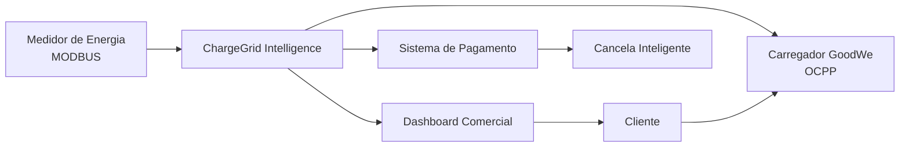
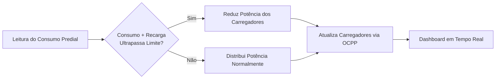
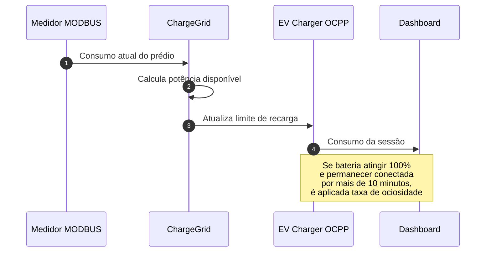

# ChargeGrid Intelligence

## Integrantes

| Nome | RM |
| :--- | :--- |
| Enzo Seiji Delgado Tabuchi | 573156 |
| Henrique Almeida Lucareli | 569183 |
| Leonardo Scotti Tobias | 573305 |
| Luca Almeida Lucareli | 569061 |
| Natan Silva da Costa | 573100 |

---


## Descrição

O ChargeGrid Intelligence é uma plataforma de gerenciamento inteligente para eletropostos comerciais.

A solução realiza:

- Controle dinâmico de demanda
- Balanceamento de carga
- Tarifação automática
- Taxa de ociosidade
- Simulação de integração OCPP
- Simulação de integração MODBUS
- Previsão de demanda utilizando IA

---

## Problema

Comércios que disponibilizam carregadores para veículos elétricos enfrentam:

- Sobrecarga elétrica
- Falta de controle de potência
- Baixa rotatividade das vagas
- Dificuldade de cobrança
- Integrações fragmentadas

---

## Solução

A plataforma monitora o consumo do prédio em tempo real e distribui automaticamente a potência disponível entre os carregadores conectados.

---

## Arquitetura
### Arquitetura Geral



### Arquitetura do Fluxo do Controle da Demanda


### Sequência Operacional


## Tecnologias

- Python
- Streamlit
- Scikit-Learn

## Execução

```bash
pip install -r requirements.txt
streamlit run app.py
```

## Funcionalidades

### Controle de Demanda
Distribuição de potência.

### Tarifação
Cobrança por consumo energético.

### Ociosidade
Multa após uma permanência excedente.

### OCPP
Simulação de controle de pagamento.

### MODBUS
Simulação de leitura do consumo predial.
